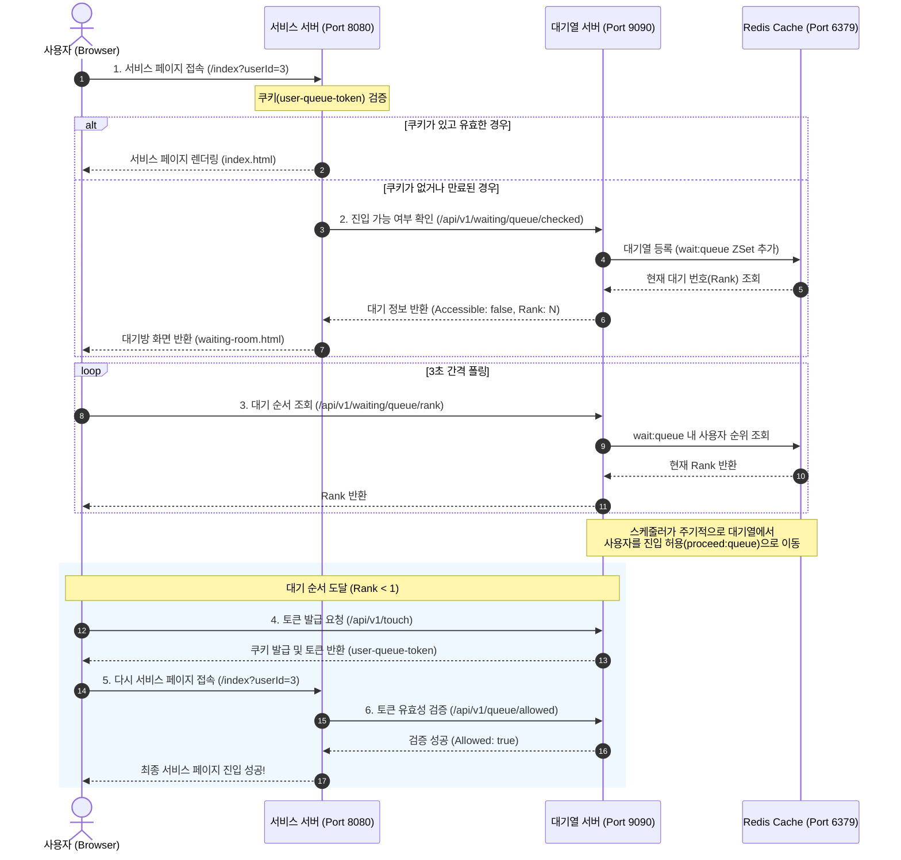

# 🚦 접속 대기열 시스템 (Traffic Waiting Queue System)

이 프로젝트는 대규모 트래픽 발생 시 서비스 안정성을 보장하기 위해 사용자 접속을 제한하고 순차적으로 진입을 허용하는 **접속 대기열 시스템**입니다. 
고성능 비동기 처리를 위해 **Spring WebFlux**와 **Reactive Redis**를 사용하며, 대기열 제어 상태를 확인하고 진입을 유도하는 프론트엔드 모듈(**Spring MVC + Thymeleaf**)이 포함되어 있습니다.

---

## 🏗️ 아키텍처 및 동작 플로우



---

## 📁 프로젝트 구조

이 프로젝트는 Gradle 멀티 모듈 프로젝트로 구성되어 있습니다.

* **`common`**: `webflux` 모듈과 `website` 모듈 간의 데이터 전송(DTO)을 위한 공통 레코드/클래스들을 포함합니다.
* **`webflux`**: 비동기 논블로킹(Non-blocking) 방식으로 동작하는 대기열 핵심 API 서버입니다.
  * **주요 기술**: Spring WebFlux, Spring Data Reactive Redis, Netty, Lombok
  * **포트**: `9090`
* **`website`**: 사용자가 최종 접속하고자 하는 메인 서비스 웹 애플리케이션 및 대기 페이지를 제공합니다.
  * **주요 기술**: Spring Boot Web (MVC), Thymeleaf, WebClient
  * **포트**: `8080`
* **`k6`**: 대기열 성능 및 처리 부하를 검증하기 위한 성능 테스트 스크립트 모듈입니다.
* **`http`**: API 테스트를 빠르고 간편하게 수행하기 위한 IntelliJ HTTP Client 파일들이 들어있습니다.

---

## ⚙️ 주요 핵심 비즈니스 로직

### 1. Redis Sorted Set (ZSet) 기반 대기열 관리
* **대기열 등록 (`wait:queue`)**: 사용자가 접속하면 Unix Timestamp를 Score로 지정하여 Redis Sorted Set에 추가합니다. 등록 순서대로 순위(Rank)가 정렬됩니다.
* **진입 허용 스케줄링 (`proceed:queue`)**: 설정된 시간 간격마다 스케줄러가 `wait:*` 패턴의 대기열에서 가장 오래 대기한 유저들을 지정한 수량(`max-allow-user-count`)만큼 꺼내(`popMin`), 진입이 허용된 유저 목록(`proceed:queue`)으로 이동시킵니다.
* **수동 진입 허용 API**: 스케줄러 외에도 수동으로 특정 인원수를 진입시킬 수 있는 어드민용 API(`POST /api/v1/waiting/queue/allow`)를 제공합니다.

### 2. 토큰 및 쿠키 메커니즘
* **토큰 생성**: 보안을 위해 `SHA-256` 해시 기반 알고리즘을 사용해 유저 ID 정보로부터 단방향 토큰(`user-queue-{userId}`)을 생성합니다.
* **쿠키 주입**: 사용자의 대기열 순서가 완료되면 `/api/v1/touch` API를 통해 클라이언트 브라우저 쿠키에 `user-queue-token` 이름으로 생성된 토큰을 저장(유효시간 5분)합니다.
* **보안 및 진입 차단**: 서비스 서버(`website`)는 이 쿠키가 존재하지 않거나, 대기열 서버(`webflux`)의 토큰 검증 API 결과가 실패할 경우 서비스 접속을 즉시 차단하고 대기방으로 리다이렉트합니다.

---

## 🚀 실행 방법

### 1. 필수 요구사항
* Java 17 이상
* Docker 및 Docker Compose

### 2. Infrastructure (Redis) 실행
프로젝트 루트 디렉토리에서 Docker Compose를 사용하여 Redis 컨테이너를 구동합니다.
```bash
docker compose up -d
```

### 3. 대기열 API 서버 실행 (WebFlux)
`webflux` 모듈을 구동합니다. 로컬 실행 프로필(`local`)이 기본으로 작동합니다.
```bash
./gradlew :webflux:bootRun
```
* **API 서버 주소**: `http://localhost:9090`

### 4. 서비스 웹사이트 서버 실행 (Website)
`website` 모듈을 구동합니다.
```bash
./gradlew :website:bootRun
```
* **서비스 주소**: `http://localhost:8080/index?userId=1` (접속 시 `userId` 쿼리 파라미터가 필수입니다.)

---

## 🔌 API 명세 (WebFlux Backend)

| HTTP Method | API Endpoint | Description | Query Parameters |
| :--- | :--- | :--- | :--- |
| **POST** | `/api/v1/waiting/queue` | 대기열 등록 및 현재 순위 조회 | `userId` |
| **POST** | `/api/v1/waiting/queue/allow` | 대기열 유저 N명 진입 허용 (어드민/스케줄러용) | `count` |
| **GET** | `/api/v1/waiting/queue/rank` | 특정 유저의 현재 대기열 순위 조회 | `userId` |
| **GET** | `/api/v1/waiting/queue/checked` | 대기열 등록 확인 및 자동 등록 처리 | `userId` |
| **GET** | `/api/v1/touch` | 진입 허용된 유저 토큰 발급 및 쿠키 생성 | `userId` |
| **GET** | `/api/v1/queue/allowed` | 진입 허용된 토큰 검증 | `userId`, `token` |

---

## 📊 부하 테스트 (k6)

대기열 상태 확인 API에 다수의 동시 접속자가 유입되었을 때의 부하 테스트 스크립트가 준비되어 있습니다.

```bash
# k6 설치 (macOS 예시)
brew install k6

# 부하 테스트 실행
k6 run k6/waiting-queue-test.js
```
이 테스트는 임의의 사용자 ID를 생성하여 `9090` 포트의 `/api/v1/waiting/queue/checked` API로 최대 1,000명의 가상 사용자(VUs)로 부하를 발생시킵니다.
